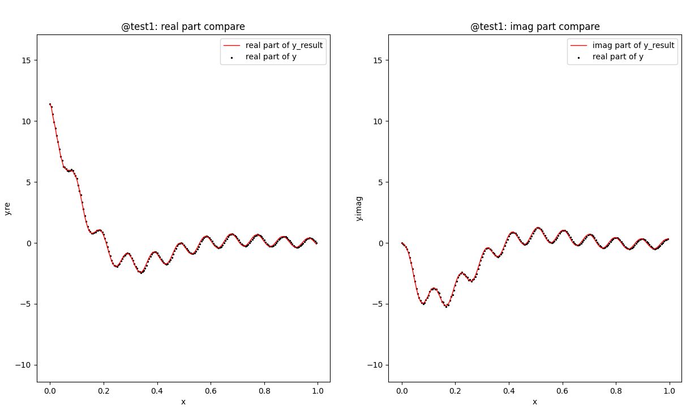

# matrix-pencil-method 

python3 algorithm that write a 1D array as `sum of exponentials` 

## description 

----
## usage
```
def pencil(y, dt, M=None, p=8.0, Lfactor=0.40):
    '''
    Purpose:
      Complex exponential fit of a sampled complex waveform by Matrix Pencil Method.
    Authors: 
      Zbb
    Arguments:
      N    - number of data samples. ==len(y)       [INPUT]
      y    - 1-D complex array of sampled signal.   [INPUT]
      dt   - sample interval.                       [INPUT]
      M    - pencil parameter. 
             if None: use p to determin M.
             if given in range(0, Lfractor*N), then use it
             if given out of range, then use p to determin M.
      p    - precise digits of signal, default 8.0, corresponding to 10**(-8.0).
    Returns: (Z, R, M, (residuals, rank, s))
      Z    - 1-D Z array. 
      R    - 1-D R array.
      M    - M in use. 
      (residuals, rank, s)   - np.linalg.lstsq further results. 
    Method:
      y[k] = y(k*dt) = sum{i=0--> M} R[i]*( Z[i]**k ) 
      Z[i] = exp(si*dt)
    
    Comment: 
      To some extent, it is a kind of PCA method. 
    '''
```

### example



see `MatrixPencil.pencil(...)` 

### requiremets 

`python>=3.0` 
site-packages: `numpy`, `scipy`, `matplotlib` 

